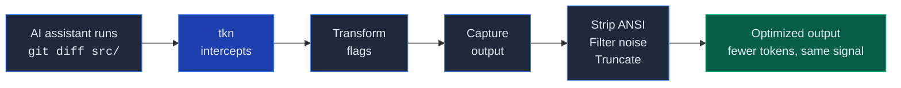

<p align="center">
  <picture>
    <source media="(prefers-color-scheme: dark)" srcset="https://github.com/lucasilverentand/tkn/raw/main/.github/logo-dark.svg">
    <source media="(prefers-color-scheme: light)" srcset="https://github.com/lucasilverentand/tkn/raw/main/.github/logo-light.svg">
    
  </picture>
</p>

<p align="center">
  <strong>Shell proxy that optimizes CLI output for AI assistants</strong>
</p>

<p align="center">
  <a href="https://github.com/lucasilverentand/tkn/releases"></a>
  <a href="https://github.com/lucasilverentand/tkn/blob/main/LICENSE"></a>
</p>

---

AI coding assistants like Claude Code spend a large chunk of their context window on raw CLI output &mdash; verbose diffs, noisy test logs, ANSI escape codes. **tkn** sits between the assistant and the shell, intercepting commands and returning optimized output that preserves the information the model actually needs while stripping everything it doesn't.

## How it works



tkn uses a **plugin system** with 35+ built-in tool plugins (git, cargo, docker, kubectl, npm, and more) that know which flags to add, which output lines to keep, and how to truncate intelligently.

## Install

```sh
curl -fsSL https://raw.githubusercontent.com/lucasilverentand/tkn/main/install.sh | sh
```

This detects your OS and architecture, downloads the latest release, and installs to `/usr/local/bin`.

### From source (via Cargo)

```sh
cargo install --git https://github.com/lucasilverentand/tkn.git --locked
```

### From source (local clone)

```sh
git clone https://github.com/lucasilverentand/tkn.git
cd tkn
cargo install --path . --locked
```

## Assistant setup

Start with a health check:

```sh
tkn doctor
```

This verifies local `~/.tkn` storage, built-in plugin availability, Claude hook state, and Codex repo hook state.

### Claude Code (machine-level hook)

Claude uses a PreToolUse hook in `~/.claude/settings.json`:

```sh
tkn setup claude
```

This initializes `~/.tkn/` if needed and installs or repairs the `tkn hook run` entry for both Bash and Zsh.

To verify or repair later:

```sh
tkn doctor claude
tkn setup claude
```

To remove the hook:

```sh
tkn hook uninstall
```

### Codex (repo-level hook)

Codex support is repo-based. `tkn` manages a Codex hook configuration and a small instructions block inside the target repo:

```sh
tkn setup codex --repo /path/to/repo
```

You can also install the repo-level Codex integration or remove its managed hook entry and `AGENTS.md` block through the hook CLI:

```sh
tkn hook install codex --repo /path/to/repo
tkn hook uninstall codex --repo /path/to/repo
```

When no target is given, the hook CLI installs both Claude and Codex hooks. For Codex, it uses the current git repository unless `--repo` is provided.

This creates or updates:

- `.codex/config.toml` with `features.codex_hooks = true`
- `.codex/hooks.json` with a Bash `PreToolUse` hook that runs `tkn hook run --codex`
- `AGENTS.md` with a managed section that tells Codex to default to:

- `tkn auto -- <command>`
- `tkn exec -- <command>` for deterministic captured output
- `tkn pass -- <command>` for interactive, long-lived, or streaming commands

Codex does not currently support rewriting `PreToolUse` command input, so the hook blocks bare Bash commands and asks Codex to rerun them through `tkn`.

To verify that a repo still has the current managed block:

```sh
tkn doctor codex --repo /path/to/repo
```

### Repair everything

```sh
tkn setup all --repo /path/to/repo
```

### Manual usage

You can also use tkn directly:

```sh
# Auto-route: tkn decides whether to optimize or pass through
tkn auto -- git diff src/

# Force optimization
tkn exec -- cargo test

# Pass through without optimization (interactive/streaming commands)
tkn pass -- docker logs -f my-container
```

## Built-in plugins

tkn ships with optimized plugins for 35+ tools:

| Category | Tools |
|----------|-------|
| **Version control** | git (diff, log, status, show, blame, branch, push, pull, fetch, stash, cherry-pick, rebase, merge, remote) |
| **Languages & build** | cargo, go, swift, xcodebuild, tsc, make |
| **Package managers** | npm, bun, pnpm, pip, deno |
| **Containers** | docker (ps, logs, build, images, inspect, compose, network, volume, system) |
| **Infrastructure** | kubectl (get, describe, logs, apply, diff, rollout, top, events, exec) |
| **Linters & formatters** | biome, eslint, prettier, ruff |
| **Search & files** | grep, rg, find, ls, tree, cat, head, tail, sed, wc, nl, du |
| **HTTP & APIs** | curl, wget, gh |
| **Testing** | pytest |

Each plugin defines flag transforms (adding `--no-pager`, removing `--color=always`, etc.) and output optimization rules (regex filters, line limits, truncation strategies).

## Commands

| Command | Description |
|---------|-------------|
| `tkn auto -- <cmd>` | Smart routing &mdash; optimize or pass through based on the command |
| `tkn exec -- <cmd>` | Force-optimize the command output |
| `tkn pass -- <cmd>` | Pass through with no optimization |
| `tkn stats` | Show token savings and usage analytics |
| `tkn log [id] [reason]` | Browse or retrieve stored command logs |
| `tkn analyze scan` | Rank tools by optimization opportunity |
| `tkn analyze report <tool>` | Analyze a specific tool's output patterns |
| `tkn plugin list` | List installed and available plugins |
| `tkn plugin install [url]` | Install built-in or third-party plugins |
| `tkn plugin remove <name>` | Remove an installed plugin |
| `tkn replay <id>` | Replay a stored command through the current optimizer |
| `tkn reasons` | Show trends in full log read reasons |
| `tkn clean` | Clear stats and logs |
| `tkn setup <claude\|codex\|all>` | Install or repair assistant integration |
| `tkn doctor [claude\|codex\|all] [--json]` | Verify tkn, Claude, and Codex setup |
| `tkn hook install [claude\|codex\|all] [--repo path]` | Install assistant hooks directly |
| `tkn hook uninstall [claude\|codex\|all] [--repo path]` | Remove assistant hooks |
| `tkn hook run --codex` | Run the Codex `PreToolUse` hook mode |

## Writing plugins

Plugins are TOML files that define how to transform and optimize a tool's output:

```toml
match = "git diff"

[transform]
add = ["--no-pager", "--stat"]
remove = ["--color=always"]

[optimize]
strip = ["^\\s*$"]          # Remove blank lines
keep = ["^[+-]", "^@@"]     # Only keep diff hunks
max_lines = 500
truncate = "tail"            # Keep the end when truncating
```

Place custom plugins in `~/.tkn/tools/` to override or extend built-ins.

## Troubleshooting

- Run `tkn doctor` after install or upgrade to catch missing hooks, stale `AGENTS.md` blocks, or local permission problems.
- If Claude is misconfigured, rerun `tkn setup claude`.
- If Codex stops using `tkn` in a repo, rerun `tkn setup codex --repo /path/to/repo`.

## License

MIT
