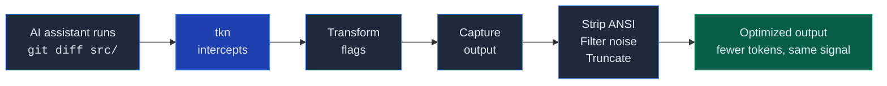

# Archived: tkn

> [!CAUTION]
> This project was archived on July 17, 2026. It is no longer maintained and
> should not be installed. Its automatic shell interception can change command
> behavior and remove evidence an AI coding agent needs to complete work safely.

## Why it was archived

The original premise was reasonable: verbose shell output consumes agent context,
and deterministic filtering can reduce that output. Real usage proved that tkn
could remove a substantial amount of text, but it did not prove that the resulting
agent runs were cheaper, safer, or more successful.

A final audit of the actual installation found:

- Across 26,492 commands, measured output fell from 274,075,790 bytes to
  139,614,829 bytes: a real reduction of 49.1%.
- `tkn stats` reported 67.2% because it substituted estimated pre-transform byte
  counts for measured output. Those estimates were not token counts or billed
  provider usage.
- In the retained 48-hour sample of 612 commands, at least 29 valid `rg --glob`
  commands were changed into invalid commands by inserting new flags between an
  option and its value. The same heuristic also broke valid `git -C <path>`
  commands.
- Line-based caps were not a reliable context bound. One 58 MB `grep` result was
  reduced by only 22 bytes because a small number of extremely long lines passed
  through the line limit.
- File-reading rules could silently remove source context: `cat` kept only the
  final 200 lines and `sed` only the final 100 lines.
- Raw command output was persisted by default for 48 hours. On the audited macOS
  installation, the logs were readable as `0644` files inside `0755` directories,
  which is not an acceptable default for output that may contain credentials.
- The test suite passed while these failures were occurring because it checked
  filter behavior, not semantic equivalence of transformed commands or end-to-end
  task success.

The surrounding ecosystem also moved on:

- [RTK](https://github.com/rtk-ai/rtk) became the established implementation of
  this product category, with broader command and agent support and an active
  maintainer community. Maintaining a second, less safe shell proxy no longer
  had a credible purpose.
- Codex added native [lifecycle hooks](https://learn.chatgpt.com/docs/hooks) and a
  configurable [`tool_output_token_limit`](https://learn.chatgpt.com/docs/config-file/config-reference#configtoml),
  reducing the need for a global proxy while still leaving interception coverage
  explicitly platform-dependent.
- The July 2026 study
  [*Token Reduction Is Not Cost Reduction*](https://arxiv.org/abs/2607.12161)
  found that removing tool-output tokens did not reliably reduce billed cost and
  could harm completion by deleting action-critical evidence. Its conservative
  RTK arm showed only a small, holdout-unconfirmed saving, while a more aggressive
  compression arm cost more.

The conclusion is therefore narrower than "output compression never helps."
Compression ratio alone is not a valid product outcome. Any future work in this
area should preserve command semantics, protect verbatim evidence, cap bytes or
tokens rather than only lines, default to private storage, and measure paired
end-to-end task success and billed cost.

## Removing an existing installation

Uninstall the managed hooks before deleting the binary:

```sh
tkn hook uninstall all
rm -f ~/.cargo/bin/tkn /usr/local/bin/tkn
rm -rf ~/.tkn
```

Review the affected assistant configuration afterward and preserve unrelated
hooks. No migration or compatibility support is provided by this archived
repository.

---

## Historical documentation

The original README is preserved below as a record of the project. Its install
and setup instructions are obsolete.

<p align="center">
  <picture>
    <source media="(prefers-color-scheme: dark)" srcset="https://github.com/lucasilverentand/tkn/raw/main/.github/logo-dark.svg">
    <source media="(prefers-color-scheme: light)" srcset="https://github.com/lucasilverentand/tkn/raw/main/.github/logo-light.svg">
    
  </picture>
</p>

<p align="center">
  <strong>Shell proxy that optimizes CLI output for AI assistants</strong>
</p>

<p align="center">
  <a href="https://github.com/lucasilverentand/tkn/releases"></a>
  <a href="https://github.com/lucasilverentand/tkn/blob/main/LICENSE"></a>
</p>

---

AI coding assistants like Claude Code spend a large chunk of their context window on raw CLI output &mdash; verbose diffs, noisy test logs, ANSI escape codes. **tkn** sits between the assistant and the shell, intercepting commands and returning optimized output that preserves the information the model actually needs while stripping everything it doesn't.

## How it works



tkn uses a **plugin system** with 35+ built-in tool plugins (git, cargo, docker, kubectl, npm, and more) that know which flags to add, which output lines to keep, and how to truncate intelligently.

## Install

```sh
curl -fsSL https://raw.githubusercontent.com/lucasilverentand/tkn/main/install.sh | sh
```

This detects your OS and architecture, downloads the latest release, and installs to `/usr/local/bin`.

### From source (via Cargo)

```sh
cargo install --git https://github.com/lucasilverentand/tkn.git --locked
```

### From source (local clone)

```sh
git clone https://github.com/lucasilverentand/tkn.git
cd tkn
cargo install --path . --locked
```

## Assistant setup

Start with a health check:

```sh
tkn doctor
```

This verifies local `~/.tkn` storage, built-in plugin availability, Claude hook state, and Codex hook state.

### Claude Code (machine-level hook)

Claude uses PreToolUse and PostToolUse hooks in `~/.claude/settings.json`:

```sh
tkn setup claude
```

This initializes `~/.tkn/` if needed and installs or repairs `tkn hook run` entries for Bash and Zsh `PreToolUse` and `PostToolUse`.

To verify or repair later:

```sh
tkn doctor claude
tkn setup claude
```

To remove the hook:

```sh
tkn hook uninstall
```

### Codex (global hook)

By default, `tkn` manages a global Codex hook configuration and a small instructions block in `~/.codex`:

```sh
tkn setup codex
```

You can also install or remove the global Codex integration through the hook CLI:

```sh
tkn hook install codex
tkn hook uninstall codex
```

When no target is given, the hook CLI installs both Claude and Codex hooks. For Codex, it uses global `~/.codex` unless `--repo` is provided.

This creates or updates:

- `~/.codex/config.toml` with `features.hooks = true`
- `~/.codex/hooks.json` with Bash `PreToolUse` and `PostToolUse` hooks that run `tkn hook run --codex`
- `~/.codex/AGENTS.md` with a managed section that tells Codex to default to:

- `tkn auto -- <command>`
- `tkn exec -- <command>` for deterministic captured output
- `tkn pass -- <command>` for interactive, long-lived, or streaming commands

The `PreToolUse` hook rewrites Bash commands through `tkn auto` before they run. The managed instructions keep Codex aligned with that routing, and the `PostToolUse` hook catches missed bare Bash commands after they run and replaces oversized output with tkn-optimized output.

For a repo-local Codex setup instead of the global one, pass `--repo`:

```sh
tkn setup codex --repo /path/to/repo
tkn hook install codex --repo /path/to/repo
tkn hook uninstall codex --repo /path/to/repo
```

To verify Codex setup:

```sh
tkn doctor codex
tkn doctor codex --repo /path/to/repo
```

### Repair everything

```sh
tkn setup all --repo /path/to/repo
```

### Manual usage

You can also use tkn directly:

```sh
# Auto-route: tkn decides whether to optimize or pass through
tkn auto -- git diff src/

# Force optimization
tkn exec -- cargo test

# Pass through without optimization (interactive/streaming commands)
tkn pass -- docker logs -f my-container
```

## Built-in plugins

tkn ships with optimized plugins for 35+ tools:

| Category | Tools |
|----------|-------|
| **Version control** | git (diff, log, status, show, blame, branch, push, pull, fetch, stash, cherry-pick, rebase, merge, remote) |
| **Languages & build** | cargo, go, swift, xcodebuild, tsc, make |
| **Package managers** | npm, bun, pnpm, pip, deno |
| **Containers** | docker (ps, logs, build, images, inspect, compose, network, volume, system) |
| **Infrastructure** | kubectl (get, describe, logs, apply, diff, rollout, top, events, exec) |
| **Linters & formatters** | biome, eslint, prettier, ruff |
| **Search & files** | grep, rg, find, ls, tree, cat, head, tail, sed, wc, nl, du |
| **HTTP & APIs** | curl, wget, gh |
| **Testing** | pytest |

Each plugin defines flag transforms (adding `--no-pager`, removing `--color=always`, etc.) and output optimization rules (regex filters, line limits, truncation strategies).

## Commands

| Command | Description |
|---------|-------------|
| `tkn auto -- <cmd>` | Smart routing &mdash; optimize or pass through based on the command |
| `tkn exec -- <cmd>` | Force-optimize the command output |
| `tkn pass -- <cmd>` | Pass through with no optimization |
| `tkn stats` | Show token savings and usage analytics |
| `tkn log [id] [reason]` | Browse or retrieve stored command logs |
| `tkn analyze scan` | Rank tools by optimization opportunity |
| `tkn analyze report <tool>` | Analyze a specific tool's output patterns |
| `tkn plugin list` | List installed and available plugins |
| `tkn plugin install [url]` | Install built-in or third-party plugins |
| `tkn plugin remove <name>` | Remove an installed plugin |
| `tkn replay <id>` | Replay a stored command through the current optimizer |
| `tkn reasons` | Show trends in full log read reasons |
| `tkn clean` | Clear stats and logs |
| `tkn setup <claude\|codex\|all>` | Install or repair assistant integration |
| `tkn doctor [claude\|codex\|all] [--json]` | Verify tkn, Claude, and Codex setup |
| `tkn hook install [claude\|codex\|all] [--repo path]` | Install assistant hooks directly |
| `tkn hook uninstall [claude\|codex\|all] [--repo path]` | Remove assistant hooks |
| `tkn hook run --codex` | Run the Codex hook mode |

## Writing plugins

Plugins are TOML files that define how to transform and optimize a tool's output:

```toml
match = "git diff"

[transform]
add = ["--no-pager", "--stat"]
remove = ["--color=always"]

[optimize]
strip = ["^\\s*$"]          # Remove blank lines
keep = ["^[+-]", "^@@"]     # Only keep diff hunks
max_lines = 500
truncate = "tail"            # Keep the end when truncating
```

Place custom plugins in `~/.tkn/tools/` to override or extend built-ins.

## Troubleshooting

- Run `tkn doctor` after install or upgrade to catch missing hooks, stale `AGENTS.md` blocks, or local permission problems.
- If Claude is misconfigured, rerun `tkn setup claude`.
- If Codex stops using `tkn`, rerun `tkn setup codex` for global setup or `tkn setup codex --repo /path/to/repo` for repo-local setup.

## License

MIT
